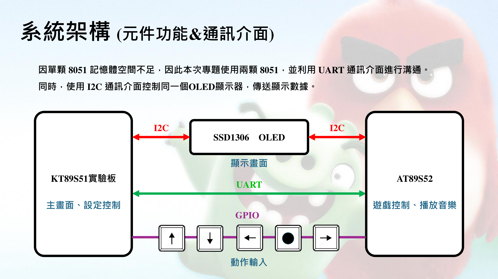
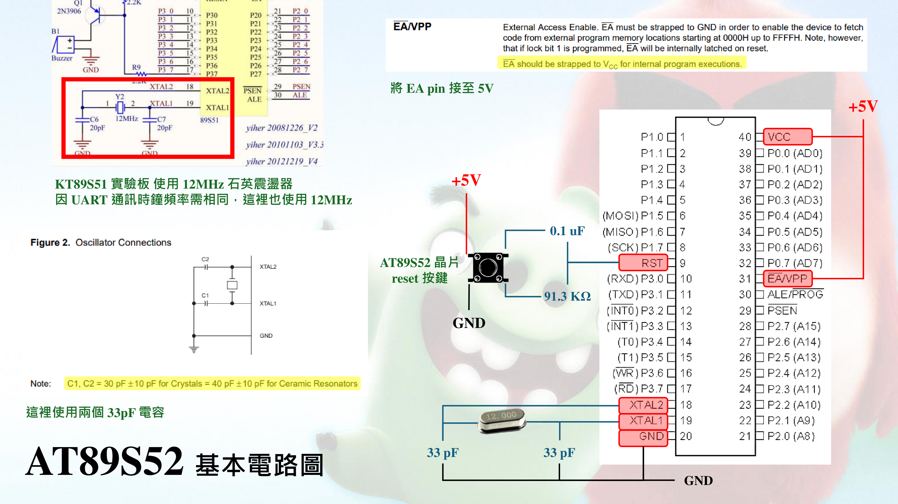
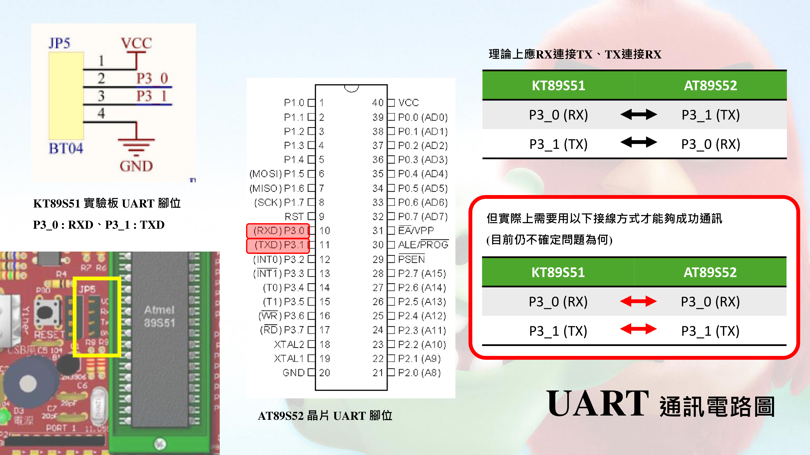
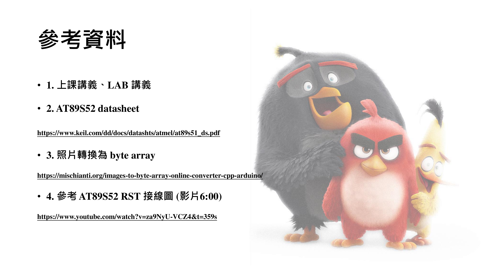

# AngryBirds with AT89S52 and OLED
This project involves an AT89S52 chip and a KT89S51 board to create an AngryBirds game. 
The communication between the components is facilitated through UART, and a visual presentation is achieved with an OLED display. 

## System Stucture

## Circuit Diagram
#### 1. The minimum ciruit to run the AT89S52 chip.

#### 2. The ciruit for communication between two chips using UART
> [!NOTE] 
> Note that this is a bit tricky.
> In my case, I have to connect TX to TX and RX to RX, then it can work. Don't figure out why...

#### 3. The ciruit for communication from two chips to an OLED using I2C
> [!NOTE] 
> Only one microcontroller can control the OLED at a time.
> Initiate the start condition signal for control and send the stop condition signal to discontinue I2C usage.

#### 4. The ciruit using two chips to jointly control five buttons for the game

## Reference

